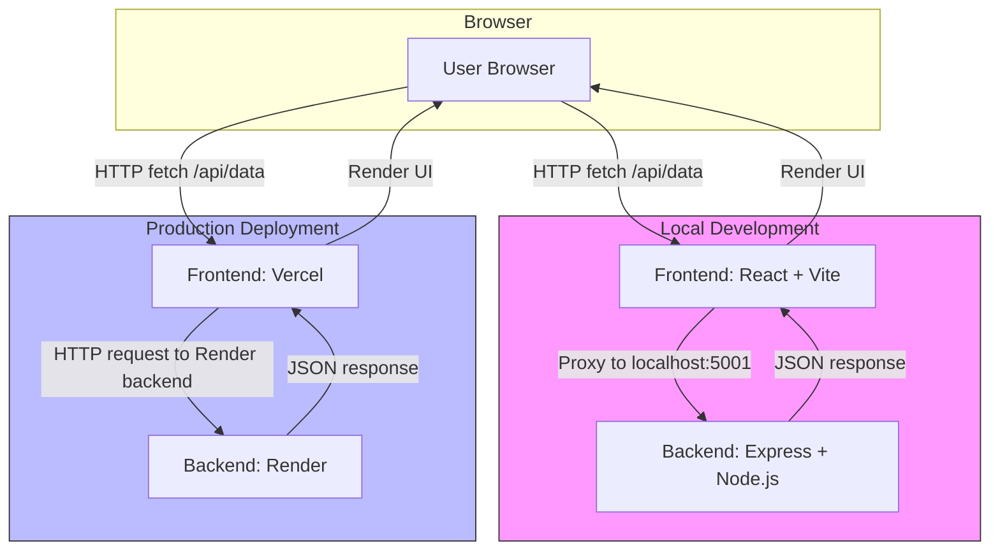

# digital-glassware-deposit
Webapp to manage deposit and return of glassware in a bar context.

# Project Name

Digital glassware deposit application for bars

---

## Problem Statement
Bars spend much money on not returned glassware. Due to the busy environment and the usually alcoholized guests a traditional glassware deposit with cash/coins or plastic tokens is difficult to maintain. Plus, in order to reimburse the costs of glassware the deposit must be relatively high.

Assumptions for situation where there is no glassware deposit:
- spending on new glassware: approx. 7000 Euro per year
- not returned glassware: 90 glasses per week
- cost per new glassware item: 6 Euro

---

## Solution

Create incentives for guests to return their glassware by themselves. Provide a benefit system that guests use to obtain perks from the bar they visit.  

Gamify the glassware return and give the returners local, real-world perks or benefits, e.g. 
- discount on drinks or merch, 
- a polaroid picture as guest of the week/day, 
- a ranking list of who's returned most glassware

Elevate the bar crew from handling cash to return any previously given deposit.

## Target groups

- Guests
- Bar owners

---

## Core Features

- Feature 1: Random character generator (incl. name, maybe avatar, maybe photo from www.thispersondoesnotexist.com)
- Feature 2: Database to track progress of each generated character 
- Feature 3: Monthly/weekly reset
- Feature 4: QR code that activates the random character

---

## User Flow / Wireframes

Guests scan publicly visible QR code and get assigned a randomized character.

Example user flow:

1. Guest finishes drink as usual
2. Guest scans visible QR code via smartphone camera app
3. Guest is directed to a website that shows the randomly generated character (random character is bound to MAC address of smartphone)
4. Guest returns used glassware to bar
5. Bar crew states receipt of returned glassware with device^* 


^* Smartphone with bar owner version of app, bar device with special NFC signal, passive NFC item like with contactless payment cards

---

## Tech Stack

This project uses a modern fullstack setup optimized for simplicity, speed, and deployability.

### Frontend
- **React**  
  - Chosen for its component-based architecture, fast rendering, and large ecosystem.  
  - Makes building interactive UIs straightforward, especially for beginners and portfolio projects.

- **Vite**  
  - Fast build tool and dev server, ideal for modern JavaScript/React projects.  
  - Provides a development proxy, hot module replacement, and optimized production builds.

- **JavaScript (JSX)**  
  - Standard language for React; enables embedding HTML-like syntax directly in JS.  

- **React Hooks (`useState`, `useEffect`)**  
  - Simple state and side-effect management without needing additional state libraries.  

- **HTTP requests with `fetch` API**  
  - Native browser API for making requests to the backend, lightweight and easy to use.

---

### Backend
- **Express**  
  - Minimal and flexible Node.js framework for building APIs.  
  - Provides easy routing, middleware integration, and fast server setup.

- **CORS (`cors` middleware)**  
  - Handles cross-origin requests during development, essential for frontend-backend communication.

- **JSON parsing (`express.json()`)**  
  - Simplifies handling JSON payloads in API requests and responses.

- **CommonJS modules (`require`)**  
  - Used for compatibility with Node.js environments without extra build setup.

---

### Fullstack Tools
- **Concurrently**  
  - Allows running both frontend and backend servers simultaneously in development with a single command.

- **Vite Proxy**  
  - Redirects frontend `/api` calls to the backend port during local development, avoiding CORS issues.

- **Environment variables (`.env`)**  
  - Allows switching between local development and production URLs without changing code.

---

### Deployment
- **Frontend: Vercel**  
  - Optimized for static frontends and React projects, easy CI/CD integration.  

- **Backend: Render**  
  - Node.js hosting with persistent URLs, simple to deploy APIs, and scalable for future projects.


## App Architecture Diagram



---

## Development Notes / Challenges

- Enable local development and deployment: Communication of frontend with backend failed. 
    - Solution: Frontend was calling itself and never triggered the backend request.
    - Usage of ChatGPT
-   
- [Challenge / Solution]  

---

## Demo / Screenshots

### Project structure

```
digital-glassware-deposit/
├─ frontend/          # React + Vite frontend
│   ├─ package.json
│   ├─ src/
│   │   └─ App.jsx (Vite starter)
│   └─ .env (VITE_API_URL points to backend)
│
├─ backend/           # Node.js + Express backend
│   ├─ package.json (CommonJS setup, no "type": "module")
│   └─ index.js (Express server with /api/data endpoint)
│
└─ package.json       # root file with concurrently setup
```

## Production deployment

This project is deployed using **Vercel (frontend)** and **Render (backend)**.
- frontend URL: https://digital-glassware-deposit.vercel.app  
- backend URL: https://digital-glassware-deposit.onrender.com

### Backend (Render)
- Hosted on [Render](https://render.com/).
- Runs the Express.js API (`backend/index.js`).
- Example production URL: `https://<your-backend>.onrender.com`

### Frontend (Vercel)
- Hosted on [Vercel](https://vercel.com/).
- Built with Vite + React (`frontend/`).
- Example production URL: `https://<your-frontend>.vercel.app`

### Environment Variables
The frontend requires an environment variable pointing to the backend API:

| Variable        | Example Value                         | Description                         |
|-----------------|---------------------------------------|-------------------------------------|
| `VITE_API_URL`  | `http://localhost:5001` (local)       | Backend API base URL for local dev. |
| `VITE_API_URL`  | `https://<your-backend>.onrender.com` | Backend API base URL for production |
```

```bash
# .env.example
VITE_API_URL=http://localhost:5001
```

---

## How to Run Locally

1. **Clone the repository**

```bash
git clone https://github.com/adrianogelato/digital-glassware-deposit.git
cd digital-glassware-deposit
```

2. **Start from root**

```bash
npm run install-all
npm run dev
```
Runs the content from the root-located package.json.

Backend runs on http://localhost:5001 (or your index.js port).
Frontend runs on http://localhost:5173 by default (Vite dev server).

4. **Open Browser**

Visit http://localhost:5173 to see the app.  

Check DevTools console and network tab for API call results.


